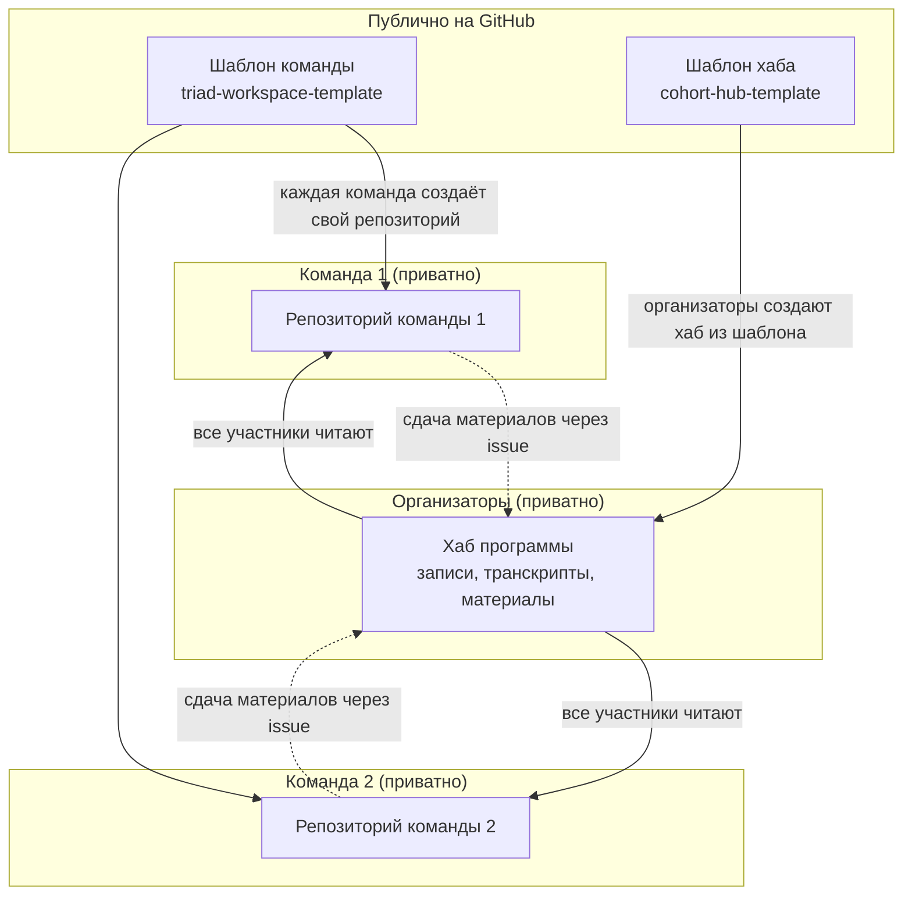
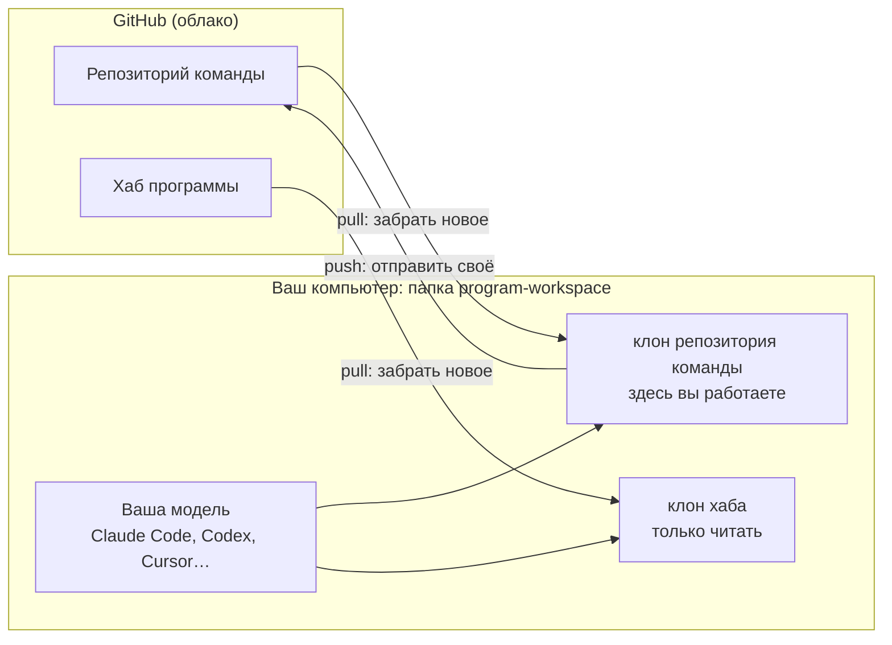
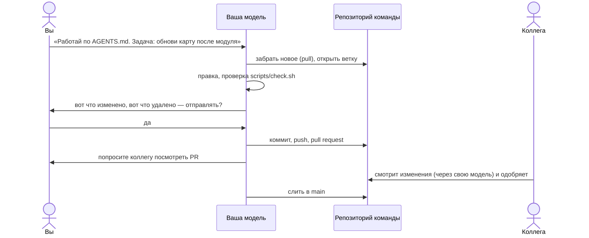
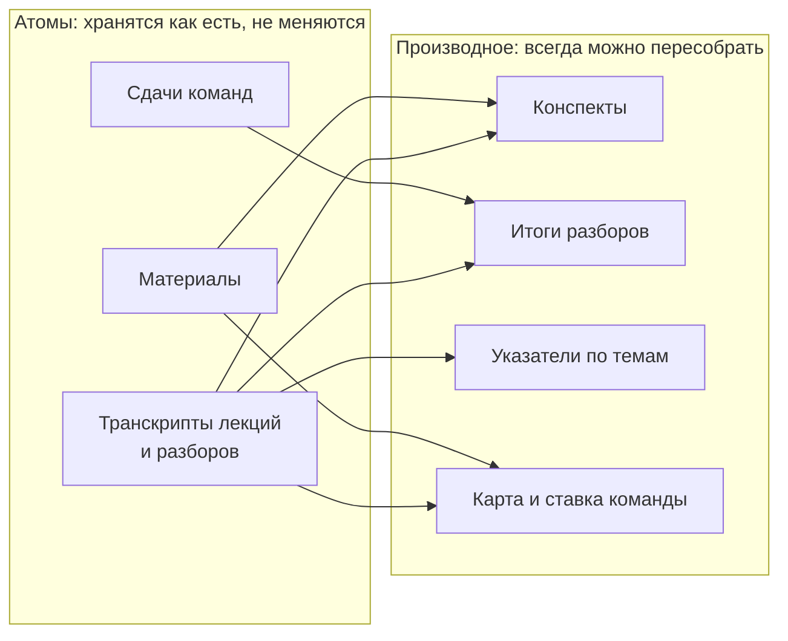
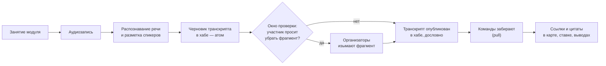
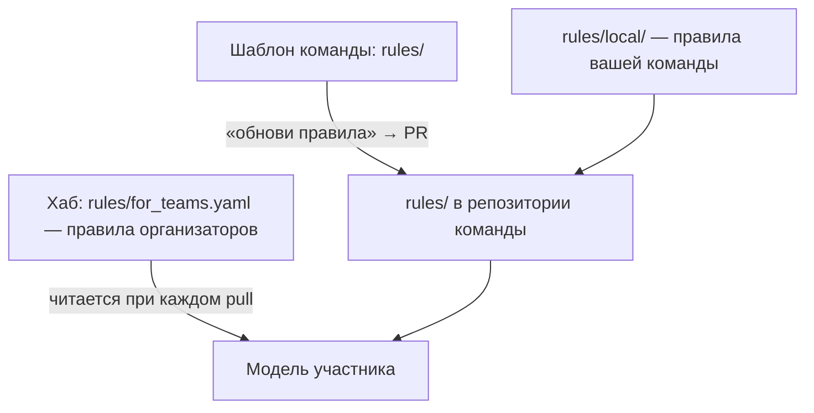
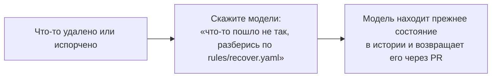

# Как это работает — схемы для тех, кто не работал с GitHub

## 1. Пять слов, которые нужно знать

| Слово | Что это простыми словами |
|---|---|
| **Репозиторий** | Папка с файлами, которая помнит каждое изменение: кто, когда и что поменял |
| **Клон** | Копия репозитория на вашем компьютере. Вы работаете в ней, а не на сайте |
| **Коммит** | Сохранённый шаг: «вот что я изменил и почему». Любой шаг можно вернуть |
| **Ветка** | Черновая линия работы. Основная линия называется `main`; свою правку вы делаете в ветке, чтобы не мешать остальным |
| **Pull request (PR)** | Просьба «добавьте мою ветку в main». Другой участник смотрит изменения и одобряет |

Всё это за вас делает модель. Вам достаточно сказать, что нужно сделать, и
отвечать на её вопросы.

## 2. Кто где работает

- Шаблоны публичные и пустые: в них только структура и правила.
- Хаб видят все участники программы; менять его могут только организаторы.
- Репозиторий команды видит только команда. Другие команды его не видят.

## 3. Что лежит у вас на компьютере

У каждого участника своя модель. Все модели читают одни и те же правила в
папке `rules/`, поэтому делают одно и то же одинаково.

## 4. Обычный день

## 5. Атомы и то, что из них строится

Любой вывод ссылается на атом — вплоть до минуты записи. Если вывод оказался
неверным, его пересобирают из атомов; сами атомы не трогают.

## 6. Как запись с модуля становится материалом команды

Сказать «это не для записи» можно до начала разговора. Если лишнее всё же
попало в транскрипт — в окно проверки можно попросить его убрать.

## 7. Как меняются правила

- Общие правила обновляются из шаблона по команде «обнови правила».
- Правила вашей команды лежат в `rules/local/`; обновления их не трогают.
- Правила организаторов (сроки, форматы) лежат в хабе и действуют сразу после
  `pull`.

## 8. Если что-то сломалось

Всё, что было закоммичено, хранится в истории, и у каждого участника есть
полная копия. Вернуть можно почти всё. Исключение одно: ключ, пароль или чужие
данные, попавшие в репозиторий, считаются раскрытыми. Ключ сразу меняют, а о
данных сообщают владельцу репозитория.
